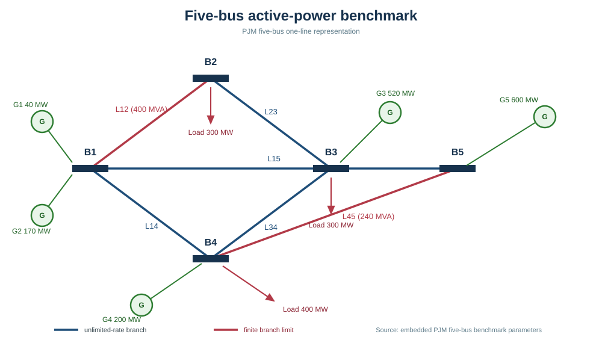

# QAOA-Based Day-Ahead Unit Commitment on the PJM Five-Bus System

This repository is a compact, reproducible study of 24-hour unit commitment
and economic dispatch on the standard PJM five-bus benchmark. It combines a binary
QUBO commitment model, the QAOA implementation used by the QPanda3 ecosystem,
and a SciPy mixed-integer/linear optimization reference. An optional OriginQ
Runtime FakeBackend path provides a local, finite-shot rehearsal with device
calibration-derived noise; no real-quantum-processor job is part of this
project.

The primary entry point is the 24-hour day-ahead driver and its accompanying
Jupyter walkthrough. The compact single-period QUBO and backend APIs remain
available as reusable building blocks for each hourly subproblem.

## Model

The model uses the buses, generators, branch reactances, and thermal limits of
the standard PJM five-bus benchmark. The numerical parameters are embedded as
ordinary Python data, so no external power-system package is needed to run the
study. Five binary generator-commitment variables are used for each
scheduling period. For a commitment bit $u_{g,t}$, the available capacity and
demand-reserve requirement are represented by the normalized penalty

```math
W\left(\sum_g \frac{P_g^{\max}}{S_{\mathrm{base}}}u_{g,t}
-\frac{D_t+R_t}{S_{\mathrm{base}}}\right)^2.
```

The continuous dispatch stage solves

```math
\begin{aligned}
\min_{p_t}\quad &\sum_g\left(a_g p_{g,t}^{2}+b_g p_{g,t}\right)\\
\mathrm{subject\ to}\quad &\sum_g p_{g,t}=D_t,\\
&P_g^{\min}u_{g,t}\le p_{g,t}\le P_g^{\max}u_{g,t}.
\end{aligned}
```

It also enforces the DC branch-flow limits of the five-bus network. The reference solves
the commitment and dispatch constraints jointly with
`scipy.optimize.milp` and evaluates the resulting dispatch with
`scipy.optimize.linprog` (or `SLSQP` when quadratic generation costs are
retained). The day-ahead reference contains 24 periods. Its local QAOA
comparison solves one five-bit commitment QUBO per hour and evaluates the
complete trajectory with the same dispatch routine.

The symbols used in the equations are:

| Symbol | Meaning |
| --- | --- |
| $t$ | scheduling hour, from 0 to 23 |
| $g$ | generator index, from 1 to 5 |
| $u_{g,t}$ | binary commitment state (1 on, 0 off) |
| $p_{g,t}$ | dispatched output of generator $g$ at hour $t$ (MW) |
| $D_t$ | demand at hour $t$ (MW) |
| $R_t$ | spinning-reserve requirement at hour $t$ (MW) |
| $P_g^{\min},P_g^{\max}$ | minimum and maximum output of generator $g$ (MW) |
| $a_g,b_g$ | variable generation-cost coefficients |
| $F_g$ | no-load cost of generator $g$ |
| $S_g$ | start-up cost of generator $g$ |
| $y_{g,t}$ | binary start-up indicator for generator $g$ at hour $t$ |
| $S_{\mathrm{base}}$ | normalization base used by the QUBO penalty (1,000 MW) |
| $W$ | penalty weight for reserve-capacity violations |



The diagram is a schematic one-line view of the PJM five-bus benchmark. The
embedded values follow the public benchmark parameters and are used directly
by the Python model.

## Backends and scope

Three local modes are available through `BackendConfig`:

- `statevector`: exact probabilities from the local pyqpanda3 CPUQVM;
- `local_fake`: finite-shot sampling without gate noise;
- `local_noisy`: finite shots plus a named synthetic gate/readout noise profile.

For the OriginQ Runtime rehearsal, `RuntimeFakeBackendRunner` calls
`RuntimeService -> QDevice -> FakeBackend -> transpile -> sample`.  This is a
local FakeBackend execution path and does not create a remote task.  The API
key is read only from the environment variable selected by the caller; its
value is never printed, stored, or committed.  A Runtime installation is
optional and is not needed for the ordinary day-ahead Notebook or local study.

## Installation

Python 3.10 or newer is supported.  The core workflow needs NumPy, SciPy,
SymPy, and pyqpanda3; Matplotlib and pytest are development extras.

```powershell
python -m pip install -e ".[dev]"
```

When running the Notebook in PyCharm, select the same project interpreter and
run the installation command in PyCharm's Terminal. The import cell searches
the current directory and its parents for `src/case5_unit_commitment`, so the
Notebook also works when PyCharm starts it from the `notebooks` directory.

The optional Runtime rehearsal additionally needs the OriginQ
`qpanda3_runtime` package available in the local environment.

## Quick start

Run the complete day-ahead study, including the classical reference and the
state-vector QAOA comparison:

```powershell
python scripts\run_day_ahead.py --output results\day_ahead
```

The driver resolves the local `src` directory from its own file location, so it
can be launched from PyCharm or another working directory without setting
`PYTHONPATH` manually.

The command writes a JSON record, a load/dispatch figure, and a per-hour cost
comparison. The reproducible Notebook walkthrough is
`notebooks/case5_day_ahead_workflow.ipynb`.

## Twenty-four-hour day-ahead scheduling

The repository also contains a complete 24-hour extension of the same
five-bus model. The default profile is a normalized daily load curve with an
overnight valley, a morning ramp, a daytime plateau, an evening peak, and a
late-evening decline. Multiplying the profile by the 1,000 MW benchmark
base load gives hourly demands between 580 MW and 1,100 MW. A 5% spinning
reserve requirement is applied independently at each hour.

For the classical reference, the commitment, start-up, reserve, network, and
dispatch variables are solved over the whole day:

```math
\begin{aligned}
\min_{u,y,p}\quad &\sum_{t=0}^{23}\left[
\sum_g\left(a_g p_{g,t}^{2}+b_g p_{g,t}\right)
+\sum_g F_g u_{g,t}+\sum_g S_g y_{g,t}\right].
\end{aligned}
```

with hourly balance and reserve constraints

```math
\sum_g p_{g,t}=D_t,\qquad
\sum_g P_g^{\max}u_{g,t}\ge D_t+R_t.
```

unit limits, the start-up relation
```math
y_{g,t}\ge u_{g,t}-u_{g,t-1}.
```

Here $u_{g,t}$, $y_{g,t}$, $p_{g,t}$, $D_t$, $R_t$, and the generator
parameters have the meanings listed in the table above; the network constraint
is the DC branch-flow limit on each transmission line.
The implementation calls SciPy's mixed-integer optimizer for commitment and
linear-program dispatch evaluation for the reported schedule.

The quantum comparison is deliberately sized for local validation: it solves
24 independent five-qubit QAOA commitment problems, one for each hour, then
passes the complete commitment trajectory through the same 24-hour dispatch
and network evaluator. This is a transparent decomposition rather than a
claim that a 120-qubit state-vector circuit has been simulated. The generated
JSON records every hourly commitment, dispatch, reserve margin, branch-flow
check, QAOA feasibility probability, and cost.

Run the complete local study from the repository root:

```powershell
python scripts\run_day_ahead.py --output results\day_ahead
```

The command writes `case5_day_ahead.json`,
`case5_day_ahead_dispatch.png`, and `case5_day_ahead_hourly_costs.png`. With
the default seed and a short four-iteration state-vector optimization, the
checked local record has a classical reference cost of about `311445.95`, an
hourly-QAOA cost of about `311504.11`, and a relative gap of `0.0187%`. These
numbers are reproducibility records for the stated settings, not a performance
claim for a real quantum processor. The dedicated walkthrough is available
in `notebooks/case5_day_ahead_workflow.ipynb`.

A reference record for these settings is included in
[`results/day_ahead/`](results/day_ahead/). The finite-shot noisy record is
kept separately in [`results/day_ahead_local_noisy/`](results/day_ahead_local_noisy/).

An additional finite-shot noisy check can be reproduced with
`--backend local_noisy --shots 128 --maxiter 2`. In the checked local run it
returned a cost of about `311500.81`, a `0.0176%` gap, no classical fallback
hours, and zero measured line-flow violation within numerical tolerance. The
finite-shot noise path is stochastic, so small changes between independent
runs are expected. This mode is a local noise model; it does not contact the
OriginQ cloud or a real backend.

An inspected Runtime FakeBackend record is included in
[`results/runtime_fakebackend/`](results/runtime_fakebackend/).  It is clearly
marked as a local rehearsal and contains no credential or remote task payload.

To use the Runtime FakeBackend adapter with a caller-owned key, set the key in
the caller's environment and run:

```powershell
$env:QPANDA3_API_KEY = "<your-OriginQ-api-key>"
python scripts\run_fakebackend.py --hardware-name WK_C180 --shots 256 --maxiter 4 `
  --output results\runtime_fakebackend
```

The placeholder above is not a credential.  Do not replace it in committed
files, notebooks, or logs.  The result record stores only the environment
variable name and a boolean presence flag.

## Package API

```python
from case5_unit_commitment import Case5QAOA, load_case5_uc, solve_milp_uc

instance = load_case5_uc()
reference = solve_milp_uc(instance, evaluate_method="linprog")
quantum = Case5QAOA(
    instance,
    backend="statevector",
    layers=1,
    seed=11,
    optimizer_options={"options": {"maxiter": 25, "disp": False}},
).solve(top_k=16, evaluate_method="linprog")
print(reference.schedule.total_cost, quantum.best_cost)
```

The public facade keeps model construction, classical dispatch, QAOA sampling,
and optional Runtime FakeBackend execution separate, so each stage can be
audited independently.

## Reproducibility and limitations

- The benchmark is deliberately small and is a validation example rather than
  a claim of quantum speed-up.
- QAOA parameter optimization is performed locally; the noisy Runtime path
  samples a final measured circuit and does not optimize on hardware.
- Runtime calibration units for T1/T2 are reported by the adapter as metadata;
  no undocumented conversion is silently applied by default.
- Results are finite-shot estimates whenever a sampled backend is selected.

## References

1. F. Li and R. Bo, “DCOPF-based LMP simulation: Algorithm, implementation
   and example,” IEEE PES General Meeting, 2010.
2. E. Farhi, J. Goldstone, and S. Gutmann, “A Quantum Approximate Optimization
   Algorithm,” arXiv:1411.4028, 2014.
3. L. Zhou *et al.*, “Quantum Approximate Optimization Algorithm:
   Performance, Mechanism, and Implementation on Near-Term Devices,” *Physical
   Review X*, 10, 021067, 2020.
4. The PJM five-bus benchmark parameters distributed in the public MATPOWER
   `case5` data set; the values are embedded locally and no MATLAB/MATPOWER
   runtime is required.
5. Origin Quantum, [QPanda3 documentation](https://github.com/OriginQ/QPanda3-doc).

## License

The project is released under the Apache License 2.0.  See [LICENSE](LICENSE).
